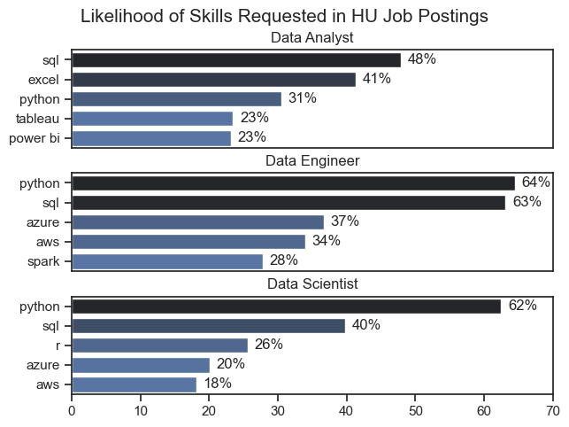

# The Analysis

## 1. What are the most demanded skills for the top 3 most popular data roles?

To find the most demanded skills for the top 3 most popular data roles in Hungary. I filtered out those positions by which one were the most popular, and got the top 5 skills for these top 3 roles. This query highlights the most popular job titles and their top skills, showing which skills I should pay attention to depending on the role I am targeting.

View the notebook with detailes steps here:
[2_Skill_demand.ipynb](3_Projects/2_Skill_Demand.ipynb)

### Data Visualization

```python
fig, ax = plt.subplots(len(job_titles), 1)

sns.set_theme(style='ticks')

for i, job_title in enumerate(job_titles):
    df_plot = df_skills_percent[df_skills_percent['job_title_short'] == job_title].head(5)
    sns.barplot(data=df_plot, x='skill_percent', y='job_skills', ax=ax[i], hue='skill_count', palette='dark:b_r')
    ax[i].set_title(job_title)
    ax[i].set_ylabel('')
    ax[i].set_xlabel('')
    ax[i].get_legend().remove()
    ax[i].set_xlim(0, 70)

    for n, v in enumerate(df_plot['skill_percent']):
        ax[i].text(v + 1, n, f'{v:.0f}%', va='center')
    
    if i != len(job_titles) - 1:
        ax[i].set_xticks([])

fig.suptitle('Likelihood of Skills Requested in HU Job Postings', fontsize=15)
fig.tight_layout(pad=0.5)
plt.show()
```

### Results



### Insights

- Python is a versatile skill, highly demanded accross all three roles, but most prominently for Data Engineers (64%) and Data Scientists (62%).
- SQL is the most required skills for Data Analysts and it is almost as demanded as python for Data Engineers.

## 2. How are in-demand skills trending for Data Analysts in Hungary?

To find the answer, I filtered data analyst positions and grouped the skills by the month of the job postings. This got me the top 5 skills of data analysts by month, showing how popular skills were throughout 2023.

View the notebook with detailes steps here:
[3_Skills_Trend.ipynb](3_Projects/3_Skills_Trend.ipynb)

### Data Visualization

```python
df_plot = df_DA_HU_percent.iloc[:, :5]
xtick_labels = ['Jan', 'Feb', 'Mar', 'Apr', 'May', 'Jun', 'Jul', 'Aug', 'Sep', 'Oct', 'Nov', 'Dec']

plt.figure(figsize=(12, 8))
sns.lineplot(data=df_plot, dashes=False, palette='tab10')
sns.set_theme(style='ticks')

plt.title('Trending Top Skills for Data Analysts in Hungary')
plt.ylabel('Likelyhood in Job Posting')
plt.xlabel('2023')
plt.xticks(ticks=range(1, 13), labels=xtick_labels)

from matplotlib.ticker import PercentFormatter
ax = plt.gca()
ax.yaxis.set_major_formatter(PercentFormatter(decimals=0))

plt.show()
```

### Results


### Insights

- SQL is consistently the most in-demand skill, peaking at 63.83% in July.
- Excel and Python see significant spikes, especially in April (Excel) and June (Python).
- Power BI and Tableau show a decrease in demand toward the end of the year, with Power BI dropping to 20% in December.